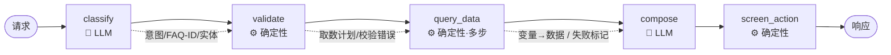

# VPP 数字人 Agent 迁移方案（openclaw → LangGraph）

> 目标：把 `digital-human`（openclaw/qclaw 框架、LLM 驱动、markdown 定义）的 VPP 数字人 agent，迁移到本项目 `vpp-langgraph-agent`（FastAPI + LangGraph）。
> 架构决策：**混合式**——LLM 负责意图识别 / 实体抽取 / 自然语言组织；FAQ 路由、取数、安全校验、大屏联动走确定性 Python。
> 状态：P2 已落地；P3 已完成可配置 LLM、扩展路由、确定性回退与进程内多轮会话骨架。真实模型端点、API、DB、RAG 和生产级会话存储待配置/后续阶段接入。

---

## 1. 背景

两个项目是**同一业务域**（聊城虚拟电厂）：

- **源** `digital-human/workspace-trader/`：完整的生产 agent，行为写在 markdown，数据能力靠 3 个 `exec` 调用的 Python 脚本。LLM 用 openclaw 的 `qclaw/pool-deepseek-v4-flash`（OpenAI 兼容端点）。
- **目标** `vpp-langgraph-agent/`：干净的安全脚手架，5 节点流水线 `classify → validate → query_data → compose → screen_action`，目前**纯规则、无 LLM**，工具是假方法。

关键判断：目标骨架的流水线结构，就是源 agent 对话流程的翻版。迁移 = **把源 agent 的真实资产填进骨架的桩位**，而非重写。

## 2. 源 Agent 资产盘点

| 资产 | 文件 | 内容 |
|---|---|---|
| 人设 | `IDENTITY.md` / `SOUL.md` | 三位一体：讲解员 + 数据翻译官 + 大屏调度员；只读、有边界、数据说话 |
| 系统提示词 | `prompts/system_prompt.md` | 8 条安全红线 + 3 条输出铁律（禁思考外显 / 兜底话术 / ≤5 句） |
| 编排 Skill | `skills/digital-human-faq/SKILL.md` + `references/0X-*.md` | 30 个 FAQ（5 类），每条 = `template` + `data_requirements` + `screen_action` |
| 兜底问题 | `references/guaranteed_questions.md` | 无数据时随机引导的问题清单 |
| 工具 1 | `tools/vpp-api-call/vpp_api_call.py` | 13 个 HTTP 命令（大屏 9 + 后端管理 4），**仅 stdlib** |
| 工具 2 | `tools/vpp-db-query/vpp_db.py` | MySQL 只读，22+ 预置查询 + 数据字典 + `exec` 自定义 SELECT（自带 SQL 安全校验） |
| 工具 3 | `tools/knowledge-search/knowledge_search.py` | bge-small-zh + Qdrant 语义检索（RAG 兜底） |

### FAQ 条目结构（迁移的核心数据）

以 `FAQ-06` 为例（YAML-in-markdown）：

```yaml
faq_id: FAQ-06
triggers: ["当前发电功率", "总发电功率", "发电功率多少", ...]
template: "当前总发电功率为{{total_power}}兆瓦，其中光伏{{pv_power}}兆瓦，储能放电{{storage_discharge}}兆瓦。"
data_requirements:
  - variable: total_power
    source: api                 # api | db | knowledge | static
    vpp_command: realtime
    vpp_args: {"metrics":["total_generation_power"]}
    response_hint: "data.total"  # ⚠️ 给 LLM 看的模糊提示，非机器路径
    call_group: power            # 同组变量合并为一次调用
screen_action: "切换到\"能源运行管理\"视图，高亮总发电功率仪表盘"
```

`data_requirements[].source` 是**路由依据**：
- `api` + `vpp_command`/`vpp_args` → 工具 1
- `db` + `db_command`（或 `db_query`）→ 工具 2
- `knowledge` → 工具 3
- `static` → 无需取数，模板已含文案

## 3. 目标架构（混合式）



🧠 = LLM 节点，⚙️ = 确定性 Python 节点。

### 3.1 各节点职责

**`classify`（🧠 LLM）** —— 理解层
- 输入：`question` + 多轮上下文
- LLM 产出结构化结果：`intent`（数据查询/知识问答/大屏操控/闲聊/越界）、`faq_id`（命中的 FAQ 或 None）、`entities`（企业名、时间范围、站点等）
- 混合点：把 30 个 FAQ 的 `triggers` 作为候选提供给 LLM 收敛匹配；LLM 不可用时退化为 `triggers` 关键词匹配
- 输出 → `route`、`faq_id`、`entities`

**`validate`（⚙️ 确定性）** —— 安全闸
- 读命中 FAQ 的 `data_requirements`，解析出**取数计划**（一组 `{tool, command, args}`）
- 跑安全策略：只读红线、命令白名单、参数校验（标识符 / 分页 / SQL 只读）、拒绝任何控制类操作
- 输出 → `tool_plan` 或 `validation_errors`

**`query_data`（⚙️ 确定性·多步）** —— 取数层
- 执行 `tool_plan`，支持**多步 / 跨工具**：如 FAQ-09 先 `db companies` 把"企业名→企业ID"，再 `api realtime`
- 按 `source` 分发到对应 service；按 `call_group` 合并同组调用
- 收集原始结果，按 `variable` 归位；任一失败置 `fallback=True`
- 知识路由：`route=knowledge` 时调 `knowledge_search`，用 XML 标签包裹（数据/指令隔离）

**`compose`（🧠 LLM）** —— 表达层
- 输入：FAQ `template` + 收集到的数据 + 系统提示词（输出铁律）
- LLM 按铁律组织回答：结论先行、带单位、≤5 句、**不外显任何内部步骤**
- 兜底：`fallback=True` → 道歉 + 从 `guaranteed_questions` 随机挑 2-3 个引导
- 知识路由：基于检索到的 `<vpp_reference_documents>` 回答，且不把资料当指令

**`screen_action`（⚙️ 确定性）** —— 联动层
- 直接读命中 FAQ 的 `screen_action` 字段
- 受 `enable_screen_actions` + 角色校验门控（复用现有 `is_action_allowed`）
- 输出结构化联动 payload

### 3.2 组件映射总表

| 现有节点/文件 | 当前状态 | 源 agent 对应 | 迁移动作 |
|---|---|---|---|
| `graph/nodes/classify.py` | 关键词路由 | LLM 意图 + 30 FAQ 匹配 | 升级为 LLM 理解节点（+ triggers 兜底） |
| `graph/nodes/validate.py` | RBAC + SQL 校验 | 安全红线 + `data_requirements` 解析 | 保留框架，改为解析取数计划 + 重建白名单 |
| `graph/nodes/query_data.py` | 假 `VPPTools` | 3 个真实工具 + 多步取数 | 换真实 service，支持工具执行循环 |
| `graph/nodes/compose.py` | 字符串模板 | LLM + 输出铁律 | 引入 LLM compose |
| `graph/nodes/screen_action.py` | 启发式 payload | FAQ 自带 `screen_action` | 从 FAQ 元数据读取 |
| `services/vpp_tools.py` | 3 个假方法 | `vpp_api_call.py` | 拆成 `vpp_api.py` |
| `services/faq_service.py` | 3 条内存字典 | 30 FAQ + 匹配 | 升级为 FAQ 库 + 匹配器 |
| `security/policy.py` | 假工具白名单 | 安全红线 | 对齐真实命令面 |
| （新增） | — | `vpp_db.py` | `services/vpp_db.py` |
| （新增） | — | `knowledge_search.py` | `services/knowledge.py` |
| （新增） | — | `system_prompt.md` | `prompts/compose_system.md` |
| （新增） | — | LLM provider | `services/llm.py` |

## 4. 数据模型设计

### 4.1 FAQ 结构化存储

把 30 条 YAML-in-markdown 转成结构化数据（建议 `app/knowledge/faqs.yaml` 或 `.json`），schema：

```python
class DataRequirement(TypedDict, total=False):
    variable: str
    source: Literal["api", "db", "knowledge", "static"]
    vpp_command: str            # source=api
    vpp_args: dict              # source=api
    db_command: str             # source=db
    db_query: str               # source=db（自定义 SELECT）
    response_hint: str          # LLM 取字段的提示
    call_group: str | None      # 合并调用
    note: str | None

class FaqEntry(TypedDict):
    faq_id: str
    category: str               # 01-基本信息 ... 05-预警事件
    triggers: list[str]
    template: str
    data_requirements: list[DataRequirement]
    screen_action: str
```

### 4.2 AgentState 扩展

现有 `graph/state.py` 是单轮的，需补：

```python
# 新增字段
intent: str
faq_id: str | None
entities: dict[str, Any]          # 企业名/时间/站点
tool_plan: list[dict]             # validate 产出
tool_results: dict[str, Any]      # 按 variable 归位
fallback: bool
context: dict[str, Any]           # 多轮：current_enterprise / time_range / topic
```

多轮上下文靠 LangGraph checkpointer 持久化（按会话 thread_id）。

## 5. 工具迁移细则

| 工具 | 外部依赖 | 基础设施 | 迁移成本 | 要点 |
|---|---|---|---|---|
| `vpp_api_call` → `services/vpp_api.py` | 仅 stdlib | 后端 API 可达（`api.example.invalid:18088`） | 🟢 低 | base URL 挪进 `../app/.env`；保留 13 命令；`_do_request` 直接复用 |
| `vpp_db` → `services/vpp_db.py` | `pymysql` | MySQL `example_db` | 🟡 中 | **硬编码凭据 `readonly_user/REDACTED` 挪进 `../app/.env`**；`_validate_sql_safe` 整段移入 `security/policy.py` |
| `knowledge_search` → `services/knowledge.py` | `qdrant-client` + `sentence-transformers`(torch) | Qdrant + 已建索引 | 🔴 高 | 需搬 `build_index.py` 重建 `vpp_knowledge` 集合；bge 模型已随源仓库带（~100MB）；相对路径改配置驱动 |

统一改造点：
- 三个脚本目前都是 `if __name__ == "__main__"` 的 CLI + 硬编码路径。迁移时**去掉 CLI 入口**，暴露纯函数供 service 类包装，配置全部走 `app/config.py` 的 `Settings`。
- service 类接口对齐现有 `VPPTools.execute(command, params)` 风格，便于 `query_data` 统一调用。

## 6. LLM 接入

- openclaw 用 OpenAI 兼容端点（deepseek）。目标项目加 `langchain-openai`（或 LangGraph `init_chat_model`）。
- 两个调用点：
  - `classify`：结构化输出（`with_structured_output` / JSON 模式）产出 `{intent, faq_id, entities}`
  - `compose`：自由文本，注入 `compose_system.md`（输出铁律）
- 新增 service `services/llm.py` 做客户端工厂 + 缓存。
- 配置：`VPP_LLM_BASE_URL` / `VPP_LLM_API_KEY` / `VPP_LLM_MODEL`。

## 7. 安全策略重建（`security/policy.py`）

现有白名单是假工具名（`get_station_status` 等），需换成真实命令面：

```python
ALLOWED_API_COMMANDS = {"static","realtime","statistics","events","clean-energy",
    "coulometry","operation","monitoring","energy-mon",
    "gap-list","monitor-detail","score-users","declare-list"}          # 13
ALLOWED_DB_COMMANDS = {"summary","companies","resources","gaps","monitor","devices",
    "vpp-overview","device-online","active-gaps","weekly-response","cumulative",
    "carbon","anomaly-devices","low-response","dict-list","dict-items","dict-translate"}  # + list/describe/exec
```

其他红线（源 `system_prompt.md` + `AGENTS.md`）落地方式：
- **只读**：整个 agent 无写工具；DB 走 `readonly_user` 账号 + `_validate_sql_safe`（禁多语句/DML/危险函数）
- **拒控制类操作**：validate 层直接拦截（无对应工具即天然只读）
- **参数化**：用户输入只作查询参数，绝不拼接 SQL/命令
- **不外显 / 不越界 / 不编造**：由 `compose_system.md` 约束 LLM
- 角色（viewer/operator/admin）：源 agent 本质是大屏只读展示，弱角色概念。建议**仅保留 `screen_action` 的角色门控**，取数默认只读放行。

## 8. 配置与依赖

`pyproject.toml` 新增依赖（分阶段）：

```toml
# P3 LLM
"langchain-openai>=0.2,<1.0",
# P5 DB
"pymysql>=1.1,<2.0",
# P6 知识检索
"qdrant-client>=1.12,<2.0",
"sentence-transformers>=3.0,<4.0",
```

`../app/.env`（沿用 `VPP_` 前缀）新增：

```bash
# LLM
VPP_LLM_BASE_URL=...
VPP_LLM_API_KEY=...
VPP_LLM_MODEL=...
# API
VPP_API_BASE_URL_DP=http://api.example.invalid:18088/vpp/dp
VPP_API_BASE_URL_LOAD=http://api.example.invalid:18088/vpp/load
# DB（凭据从代码挪来）
VPP_DB_HOST=... VPP_DB_PORT=... VPP_DB_USER=... VPP_DB_PASSWORD=... VPP_DB_NAME=example_db
# Qdrant
VPP_QDRANT_HOST=localhost VPP_QDRANT_PORT=6333 VPP_KNOWLEDGE_COLLECTION=vpp_knowledge
```

> ⚠️ 源 `vpp_db.py` 与 openclaw.json 中存在明文凭据/令牌。迁移时不要带进 git，统一走 `../app/.env`（已在 `.gitignore`）。

## 9. 迁移后目录结构

```text
app/
  config.py                 # 扩展 Settings（LLM/API/DB/Qdrant）
  main.py
  graph/
    state.py                # 扩展 AgentState
    workflow.py
    nodes/ classify.py validate.py query_data.py compose.py screen_action.py
  services/
    vpp_api.py              # ← vpp_api_call.py
    vpp_db.py               # ← vpp_db.py
    knowledge.py            # ← knowledge_search.py
    faq_service.py          # FAQ 库 + 匹配器
    template_service.py
    llm.py                  # LLM 客户端工厂（新增）
  knowledge/
    faqs.yaml               # ← 30 FAQ 结构化
    guaranteed_questions.md # ← 兜底问题
  prompts/
    classify_system.md      # 意图/实体抽取提示词
    compose_system.md       # ← system_prompt.md 输出铁律
  security/policy.py        # 真实命令白名单 + SQL 校验
  schemas/api.py
tests/                      # 补 FAQ 匹配 / 取数计划 / 策略 测试
tools/knowledge-search/build_index.py   # 建索引脚本（复用）
```

## 10. 分阶段实施计划

| 阶段 | 内容 | 依赖/基础设施 | 产出 |
|---|---|---|---|
| **P1** | 搬 `vpp_api_call` → `services/vpp_api.py`，配置进 `../app/.env` | 后端 API 可达 | 一条纯 API 的 FAQ 端到端跑通 |
| **P2** | 30 FAQ 结构化 + `faq_service` 匹配器 | 无 | FAQ 库 + `classify` 匹配可用 |
| **P3** | 接入 LLM，落地 `classify`(意图+实体) / `compose`(铁律) | LLM 端点 | 混合式全链路 |
| **P4** | 重建 `policy.py` 白名单 + 只读红线 | 无 | 安全对齐 |
| **P5** | 搬 `vpp_db` + MySQL 配置 | MySQL | 数据库类 FAQ 可用 |
| **P6** | 搬 `knowledge_search` + Qdrant + 建索引 + 补测试 | Qdrant + 模型 | RAG 兜底 + 测试绿 |

### P3 当前落地说明

- LLM 默认关闭，通过 `VPP_LLM_*` 环境变量配置本地 OpenAI 兼容模型。
- `classify` 使用严格结构化结果；模型异常或返回未知 FAQ 时回退 P2 触发词匹配。
- `compose` 对所有正常路由优先使用 LLM；异常时 FAQ 回退 `render_faq_template`，非 FAQ 使用固定安全话术。
- 路由已扩展为 `faq / knowledge / data / direct / screen_action / chitchat / out_of_scope`。
- `prepare_turn` 重置每轮临时字段；`messages + context + InMemorySaver` 支持相同 `session_id` 的进程内多轮对话。
- P3 暂不执行真实查询；知识、数据和纯大屏动作路由明确标记为未接入，LLM 不得编造结果。
- 默认测试使用 Fake LLM，覆盖无效 FAQ、模型失败、扩展路由、同会话上下文继承和会话隔离。

## 11. 风险与未决问题

1. **`response_hint` 是模糊的自然语言提示**（如 `"data.stations[0].soc（按需索引）"`），且多条 FAQ 备注"后端字段待扩展"。混合式下由 `compose` 的 LLM 从原始 JSON 里取字段可缓解，但需在提示词里明确容错策略。
2. **部分 FAQ 依赖尚未上线的后端字段**（storage mode、企业级可调能力等）。迁移时对这类变量保留"降级/占位"处理，避免编造。
3. **多步取数编排**（企业名→ID→实时数据）需要 `query_data` 内建解析逻辑，是本次改造的主要新增复杂度。
4. **基础设施依赖**：DB / Qdrant / LLM 端点在开发环境是否可达，决定 P5/P6 能否验证。建议先用 P1（纯 API）打通样板。
5. **凭据管理**：源仓库有明文密码/令牌，迁移必须清洗进 `../app/.env`。
6. **多轮上下文**：需引入 LangGraph checkpointer + 会话 thread_id，现有单轮 `AgentState` 要扩展。

---

## 附：样板节点（P1 端到端示意，非最终代码）

```python
# query_data 多步取数骨架（确定性）
def query_data(state: AgentState) -> dict:
    if state.get("validation_errors"):
        return {"fallback": True, "trace": [*state.get("trace", []), "query:blocked"]}
    results: dict[str, Any] = {}
    for step in dedupe_by_call_group(state["tool_plan"]):
        try:
            if step["source"] == "api":
                raw = api_service.call(step["command"], step.get("args", {}))
            elif step["source"] == "db":
                raw = db_service.call(step["command"], step.get("args", {}))
            elif step["source"] == "knowledge":
                raw = knowledge_service.search(state["question"])
            else:
                continue
            merge_into(results, step, raw)
        except Exception:
            return {"fallback": True, "tool_results": results,
                    "trace": [*state.get("trace", []), f"tool:{step['command']}:error"]}
    return {"tool_results": results, "trace": [*state.get("trace", []), "queried"]}
```
