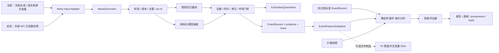

# P2 新闻事件与电价分析技术方案（草案）

| 字段 | 内容 |
|---|---|
| 文档类型 | P2 独立技术方案草案 |
| 状态 | Draft，待技术评审；合成闭环通过、真实规则基线不合格、结构化模型边界已实现，尚非生产能力 |
| 编写日期 | 2026-08-28（末次更新 2026-08-31） |
| 当前目标 | 合成闭环、真实来源开发集和模型抽取代码边界已完成；下一步是真实模型盲测与外部 API 适配器 |
| 生产输入边界 | 新闻采集由外部 API 负责；本系统只分析已经收集并可追溯的新闻 |
| 进展状态 | [P2 进展状态：已完成、未完成与当前关键问题](./phase2-status.md)（本文定义目标与门禁，状态文档回答“现在到哪了”） |
| 系统基线 | [Agent 技术方案](./agent-technical-proposal.md)、[架构设计](./agent-architecture-design.md)、[P1 技术实现与决策说明](./technical-approach.md) |

## 1. 决策摘要

本阶段不开发新闻爬虫、轮询任务或第三方采集重试。当前测试使用本地冻结的合成新闻和真实来源短摘录代替外部 API；生产接入时，由适配器把“已经收集好的新闻”转换为相同的内部契约。这样，测试和生产只替换输入适配器，不替换事件分析逻辑。

P2 首先回答：**在不依赖实时采集、严格遵守信息可获得时间并保持结果可复现的前提下，系统能否从新闻中形成可核验的事件证据，并识别这些事件与电价水平、尖峰和波动的时间关系？**

当前推荐结论如下：

1. P2 与 P1 保持弱耦合。两者共享模型网关、权限、审批、哈希、checkpoint 和报告骨架，但各自维护领域契约、计划、函数、评估器和测试。
2. 原始新闻不能直接塞入 P1 的 `SeriesSpec`。P2 先形成 `NewsDocument`、`EventRecord` 和带 `as_of` 的事件特征快照；只有派生后的数值特征可以通过文件制品桥接给 P1。
3. 第一轮先用人工金标准 `EventRecord` 验证下游电价分析，再接入新闻抽取器，避免把统计错误与模型抽取错误混为一谈。
4. 默认 CI 不访问外部 API、不调用真实大模型、不依赖系统当前时间。真实模型只运行独立的资格测试，输出必须固化并可复核。
5. P2 MVP 只产出描述性关系和事件关联证据，不宣称因果关系，也不把“新闻能解释历史价格”写成“新闻能提高预测”。预测增量需要另行通过严格的样本外实验验证。

### 1.1 当前实现状态

截至 2026-08-31，六个研究问题的合成闭环、真实来源开发基准和结构化模型抽取边界已经形成测试实现：

| 研究问题 | 状态 | 当前证据 |
|---|---|---|
| 1. 新闻稳定规范化 | 已完成合成与真实来源开发数据实现 | `NewsDocument` 保留来源、版本、发布时间、首次取得时间、更新时间、UTC 可用时间和 SHA-256 内容哈希；真实开发集另保留来源层级、抓取时点和发布时间精度，人工金标准不进入模型输入 |
| 2. 明显新闻事件抽取 | 合成夹具通过；真实规则基线不合格；模型边界已实现 | 合成夹具逐字段通过；10 条真实来源开发集证明规则基线召回率为 0%；结构化模型候选必须经过字段证据、时间、单位、置信度和隔离门禁，真实模型尚未运行资格测试 |
| 3. 去重、修订与 `as_of` | 已完成模拟数据实现 | `N01`/`N02`/`N03`/`N10` 归为同一事件且不重复计数；版本库保留全部历史，按 `as_of` 回放时更正生效而公告时间不漂移；完全相同的重复采集被丢弃 |
| 4. 市场时钟与时间对齐 | 已完成模拟数据实现 | 测试使用统一 30 分钟结算网格，代码支持可配置且整除一天的间隔；公告轴与生效轴分别声明零点；提前量可正可负；特征按公告可用时间逐区间门禁 |
| 5. 事件—电价关联 | 已完成模拟数据实现 | 八周合成价格（含负价）；固定窗口 `[0,1h]`/`[0,6h]`/`[0,24h]`、同刻对照窗口、时间平移安慰剂、置换检验与 Holm 校正；注入方向被恢复，负对照未被报为效应 |
| 6. 完整证据链 | 已完成模拟数据实现 | 每条结论回链到事件、文档版本、内容哈希、来源与逐字原文；模型路径另带模型名、Prompt/schema 版本和输入输出哈希；同一输入两次运行完全一致 |

代码位于 `app/research/news/`：`versioning` 保存版本历史与 `as_of` 视图，`merging` 合并转载与更正，`clock` 提供统一市场时钟与三条时间轴，`prices` 是分析侧的中性价格契约，`analysis` 执行预注册统计，`features` 构造并门禁事件特征，`evidence` 汇总证据包，`pipeline` 把这些串成唯一入口。`model_extraction` 定义原生结构化模型输出及本地安全校验。`synthetic` 是夹具答案生成器，边界测试禁止任何分析模块导入它。`ExternalNewsApiPlaceholder` 会明确失败且不发起网络请求；当前输入由 `JsonlCollectedNewsAdapter` 读取冻结 JSONL。`ObviousNewsEventExtractor` 继续作为显式测试文本的确定性基线；`StructuredNewsEventExtractor` 只有在调用方显式注入模型网关时才会访问模型，不代表真实模型已经通过验收。

需要显式记录的裁剪：**当前事件契约仍未冻结为生产版本**。信息可用时间、文档集合引用、事件状态、时间精度、量值语义、抽取哈希和复核状态字段已经补齐；模型置信度当前只用于接收/隔离门槛，尚未传播到合并事件供人工复核排序。逐字段状态见 5.2 表。阅读本节时不要把“代码边界已完成”理解为“真实模型已经通过”。

规则基线的已知边界（不是缺陷，是基线定义）：它按关键词判类型，不理解否定表述；同一文档命中多个事件类别时不猜测主次，直接隔离；容量必须带明确的受影响限定词才会被采纳，裸露的 MW 数字一律留空。

规则基线的事件时间接受两种写法：正文给出的绝对时间戳，以及“相对日期 + 明确时刻”（例如“次日 14:00—19:00”）。后者以来源发布时间为锚点，在显式配置的市场时区里换算成日期，测试默认 `UTC`；换算结果会连同锚点和时区一起保存，下游可以区分“原文写明的时刻”和“系统推算的时刻”。**模糊时段不予推断**：“今日上午”“预计傍晚”没有可辩护的具体时刻，凭空给一个小时就是编造，因此这类文档进入隔离区。同理，正文出现多个相对时间又没有明确生效区间时也隔离，不猜哪一个才是事件时间。模型路径另支持标题日期与正文当地时刻的组合，但必须记录 `stated_components`、时间精度和目标市场 UTC offset。

## 2. 已确认、待确认与范围

### 2.1 已确认

- 新闻采集由外部 API 负责，采集系统不属于本方案的开发范围。
- 实际应用分析的是外部系统已经收集并保存的新闻，不在分析执行时临时抓取网页。
- 当前开发从测试开始，需要构造事件含义明确、预期结果清楚的新闻夹具。
- P2 不应与现有 P1 EDA 代码形成强耦合。

### 2.2 尚待确认

- 生产市场、区域、价格品种、价格单位、结算间隔和默认研究时区。市场时钟与抽取器时区均为显式配置且必须一致；生产应从同一权威配置构造二者，不需要改抽取逻辑。
- 外部 API 的样例响应、分页方式、修订语义、稳定 ID、许可与原文留存限制。
- 生产环境使用结构化模型主路径、规则快速路径还是二者组合，以及模型供应商和固定版本。
- 独立真实新闻盲测集的规模、标注规则、复核角色和最终准入阈值；现有 10 条真实来源金标准只作为开发集。
- 首个产品出口是离线研究报告、桌面交互分析，还是定时生成的事件证据包。

这些未决项不阻塞合成夹具概念验证，但在生产适配器和真实数据影子运行前必须确认。

### 2.3 本轮范围

包含：

- 内部新闻、事件和事件特征契约；
- 合成新闻、合成价格和预期事件金标准；
- 冻结真实来源开发集、独立人工金标准和抽取资格评估器；
- 时间可获得性、去重、修订和事件合并规则；
- 共享 `ModelGateway` 上的原生结构化新闻抽取器、本地安全门禁及确定性测试替身；
- 事件与电价的窗口分析、对照窗口、安慰剂和负结果表达；
- 独立测试、证据制品、结果哈希和 P1 回归保护。

不包含：

- 新闻抓取、外部 API 调度、认证、限流和采集告警；
- 真实模型选型、线上资格运行和独立盲测集标注；
- 交易建议、自动交易、实时告警和生产监控；
- 端到端电价预测模型、交易收益回测或因果效应声明；
- 以通用情感分数作为唯一新闻特征；
- 在方案验证前重写 P1 Graph 或把 P1 的 `EDAPlan` 扩展为通用大契约。

## 3. 研究问题与可回答子问题

主问题拆成六个一次分析可以回答的子问题：

1. 已收集新闻能否被稳定规范化，并保留来源、版本、内容哈希和三类时间语义？
2. 对含义明确的测试新闻，抽取结果能否正确识别相关性、事件类型、区域、资产、容量和生效区间？
3. 同一事件的转载、重复抓取和更正新闻能否避免重复计数，并在任意 `as_of` 时点重建当时可见版本？
4. 新闻可获得时间、事件生效时间和价格时间轴能否在同一市场时钟下无泄漏地对齐？
5. 给定金标准事件，确定性分析能否恢复合成价格中注入的方向和时间窗口，同时不为无关新闻和长期新闻制造短期效应？
6. 每个结论能否回链到新闻证据片段、事件记录、价格窗口、方法版本和输入输出哈希？

第一轮明确不回答“新闻是否能在真实市场稳定提高未来电价预测”。该问题需要时间顺序切分、强基线和独立测试集，应在 P2 事件证据稳定后另立实验门禁。

## 4. 推荐架构与弱耦合边界



图中的组件名首先表示职责边界；规则基线、结构化模型抽取和本地门禁已有独立代码实现，外部新闻 API 与产品工作流尚未接入。

### 4.1 依赖规则

P2 代码已经放在独立领域目录 `app/research/news/`。必须继续满足：

- P2 不导入 `EDAPlan`、`EDASubagent`、`EDAExecutionService` 或 P1 的 EDA 函数字面量联合类型。
- P1 不导入 P2 的新闻文档或事件契约。
- P1 与 P2 只依赖共享基础设施，或通过带版本和哈希的制品交换数据。
- 若 P1 要研究事件特征，只读取 P2 输出的数值表，例如 `event_features.parquet`。
- **跨阶段可获得性由 P2 负责，不得依赖 P1 代劳。** P1 当前的 `available_at` 只进入质量报告的统计与提示（滞后中位数、最大滞后、滞后行占比），对齐时间轴时并不按行过滤，因此它是一道提示而不是闸门。P2 必须在导出前就把事件特征按可用时间对齐，使导出表的每一行在其 `interval_start` 上本身就不含未来信息；`as_of` 随表导出仅用于追溯，不作为下游过滤的前提。若将来改为由 P1 按行过滤，必须先给 P1 增加真实的行级门禁和对应回归测试，再修改本条。
- 增加 import-boundary 测试，禁止未来提交反向穿透领域边界。

### 4.2 为什么先不接入现有 Graph

当前 `StudyConfig` 以数值时间序列为中心，当前工作流也会拒绝非 `eda` 域 Skill。第一轮若直接把新闻塞入现有循环，会迫使新闻契约伪装成 EDA 契约，并让每次失败同时涉及 Graph、模型抽取和统计分析。

因此第一轮使用独立的 P2 应用服务完成“冻结输入 → 事件 → 分析制品”的端到端测试。只有领域契约和分析出口稳定后，再评审是抽取通用研究循环，还是为 P2 增加并列工作流。这个顺序不会阻止未来共享审批、checkpoint 和报告基础设施。

### 4.3 当前模型抽取技术实现

初稿只要求“Extractor 接口 + stub/冻结输出”，实际实现进一步复用了项目已有模型基础设施：

详细实现与复现命令见[结构化模型新闻抽取实现说明](./structured-news-extraction.md)。

- `StructuredNewsEventExtractor` 依赖共享 `ModelGateway` 协议，生产调用可使用 `ResearchModelGateway`；
- 通过 `invoke_structured` 和 Pydantic schema 请求原生结构化输出/Function Calling，不从普通文本或 Markdown 中抢救 JSON；
- 模型只提出 `ModelNewsExtraction` / `ModelEventCandidate` 候选，本地程序负责原文证据定位、单位换算、时间与市场时区校验、价格方向映射和最终 `EventRecord` 构造；
- 模型输出不合法、证据不是原文子串、短期时间不精确、量值语义未知或置信度低于阈值时，一律 fail closed 到 `ExtractionQuarantine`；
- `zoneinfo.ZoneInfo` 负责市场时区，日期与当地时刻组合必须使用目标市场当日的正确 UTC offset；
- Prompt、输出 schema、模型名以及规范化输入/结构化输出的 SHA-256 哈希写入 `ExtractionTrace`，并传播到合并事件、事件指纹和结论证据链；
- 抽取器按不可变 `document_version_id` 做实例内缓存；事件合并与证据构造复用同一次结果，不会在一次研究中二次调用模型；
- 默认流水线仍实例化 `ObviousNewsEventExtractor`。只有显式注入 `StructuredNewsEventExtractor` 或命令行选择 `--extractor structured-model` 才会调用模型。

这一实现与“让大模型直接输出价格结论”不同：模型负责新闻事实语义，本地确定性分析负责价格方向假设、时间窗口、统计检验和证据包。CI 使用脚本化原生结构化响应，不访问真实模型端点。

## 5. 内部数据契约

### 5.1 `NewsDocument`

| 字段 | 规则 |
|---|---|
| `document_id` | 由规范化后的来源名称和 `source_document_id` 派生的稳定内部 ID |
| `version` / `document_version_id` | 来源版本号及由文档身份、内容哈希、版本和时间语义派生的不可变版本 ID；禁止原地覆盖 |
| `source_name` / `source_ref` | 来源名称和可追溯引用；不强制必须保存公开 URL |
| `title` / `body` | 当前版本文本；如许可不允许长期留存，可只在受控层处理并保存证据摘要与哈希 |
| `published_at` | 来源声明的发布时间，必须带时区 |
| `first_seen_at` | 本系统或外部采集系统首次取得该版本的时间，必须带时区 |
| `updated_at` | 来源更正或更新的时间，可空但不可早于发布时间 |
| `language` / `market_tags` | 来源语言与目标市场标签；进入价格分析前必须与研究市场一致 |
| `raw_metadata` | 保留适配器提供的来源层元数据；开发集用其记录来源层级、抓取时点和发布时间精度，不放人工金标准 |
| `content_hash` | 规范化文本的内容哈希，用于版本、重复和证据身份 |

保守的可用时间定义为：

```text
available_at = max(published_at, first_seen_at)
```

任意截止时点 `t` 只允许使用 `available_at <= t` 的文档版本。缺失发布时间、首次取得时间或时区的新闻可以入隔离区，但不能进入事件—电价分析。

### 5.2 `EventRecord`

下表的“当前状态”列描述截至 2026-08-31 的代码实现。未实现字段是有意裁剪，不是遗漏。

| 字段 | 规则 | 当前状态 |
|---|---|---|
| `event_id` | 跨转载、重复抓取和更正保持稳定的事件 ID | 候选 ID 由类型、区域、资产和开始时间派生；更正可能改变候选 ID，合并层通过来源 lineage 归并并保留最早候选作为稳定 `MergedEvent.event_id`；同文兄弟事件按资产与区域保持分离 |
| `source_event_ids` | 合并事件引用的原始候选事件 ID，用于修订和同文多事件证据隔离 | 已实现于 `MergedEvent`；证据查询只接受属于该合并事件的原始候选 ID |
| `document_refs` | 形成该事件判断的文档版本和内容哈希列表 | 已实现于 `MergedEvent`；`EventRecord` 仍为单文档候选，合并后才带完整引用列表 |
| `relevance` / `event_type` | 是否与短期电价研究相关，以及受控事件类型 | 已实现 |
| `affected_regions` / `affected_assets` | 允许未知，不允许从常识无依据补全 | 已实现 |
| `announcement_available_at` | 系统最早可以使用该事件信息的时间 | 已实现；取自来源文档的 `available_at`，合并时取最早贡献文档，更正与转载都不会让它前后漂移 |
| `effective_start_at` / `effective_end_at` | 事件生效区间；不确定时显式保存范围或未知 | 已实现；另记录 `instant/hour/day/month/range/vague/unknown` 精度，日期级或模糊短期事件不得伪装成午夜时刻 |
| `physical_effect` | 供给、需求或输电能力的增减、混合或未知；只描述新闻事实 | 已实现；这是模型负责提出并提供证据的方向语义 |
| `direction` | 对目标价格的先验压力：`up`、`down`、`mixed`、`unknown`，不是统计结论 | 已实现；由 `physical_effect` 在本地确定性映射，模型不直接预测价格涨跌 |
| `time_resolution` | 记录原文绝对时间、原文日期/时刻组合或基于发布时间推算的相对时间 | 已实现；组合和推算均保存市场时区，推算额外保存发布时间锚点 |
| `magnitude_value` / `magnitude_unit` | 例如 500 MW；必须能回链到正文证据 | 已实现为 `EventMagnitude`：保留原值、单位、原文、MW 换算值和水平/变化/损失/恢复语义；只有变化类量值进入兼容字段 `capacity_mw` |
| `status` | 发生、恢复、计划、预测、更正、取消或未知的事件生命周期 | 已实现；但它不等价于独立的 `planned/unplanned/unknown` 属性，后者仍需按真实语料决定是否新增 |
| `evidence_refs` | 字段级证据片段位置或稳定引用，每个关键字段都必须有依据 | 已实现为 `evidence`，保存事件 ID、文本域、字符区间和逐字引文；同文多事件不能借用兄弟事件证据 |
| `extractor_id` / `extractor_version` | 规则、模型、提示词和 schema 版本 | 已实现；模型路径另保存模型名、Prompt/schema 版本及输入输出哈希 |
| `extraction_trace` | 复现一次模型抽取所需的模型名、Prompt/schema 版本和输入输出哈希 | 已实现于 `EventRecord`，合并后成为去重的 `extraction_traces` 并进入结论证据链 |
| `confidence` | 仅用于复核排序，不得替代字段证据或统计显著性 | 部分实现；模型候选低于阈值即隔离，尚未传播到合并事件供人工排序 |
| `review_status` | `unreviewed`、`accepted`、`corrected`、`rejected` | 契约已就位于 `MergedEvent`，当前恒为 `unreviewed`；人工复核流程落地后才会被写入 |

抽不出合法事件的文档不会中断整批，也不会退化成伪造字段的事件，而是产生隔离记录。除时间、多事件和契约错误外，模型路径还区分模型不可用、响应 schema 无效、原文证据无效、数量语义含糊和低置信度。

首轮最小事件类型集合：`generation_outage`、`generation_restore`、`transmission_constraint`、`demand_shock`、`renewable_supply_change`、`fuel_supply_change`、`policy_long_horizon`、`irrelevant`、`unknown`。集合是否适合生产市场，需要用真实新闻样本评审后再冻结版本。

### 5.3 `EventFeatureSnapshot`

事件派生数值特征必须包含：

- `interval_start` 与市场时区；
- `as_of`，表示这组特征在何时可被构造；
- 事件类型计数、活跃事件标记、方向计数和有证据时的受影响容量；
- `source_event_ids`、特征规则版本和输出哈希；
- 未知值与零的明确区分。

**已实现。** 契约层强制“无活跃事件时容量必须为未知而不是零”，并要求行按 `interval_start` 递增且不重复。构造时对每个结算区间只计入**在该区间开始前已经公告**的事件：停运在 10:00 生效、公告 10:07 可用，则 10:00—10:30 区间计数为 0，10:30 起才计入。

导出给 P1 的扁平表里 `available_at` 恒等于 `timestamp`，因为门禁已经在 P2 侧完成；即使下游忽略该列也无法通过这张表看到未来。集成测试用 P1 的真实加载器读回该表来验证这一点。

第一轮不引入向量数据库或通用文本 embedding。先验证可解释事件特征，后续只有在明确的增量实验中证明必要性，才增加高维文本特征。

## 6. 合成新闻与价格夹具

### 6.1 夹具原则

夹具使用虚构市场 `TEST_MARKET`、虚构区域 `TEST_NORTH` / `TEST_SOUTH` 和固定 UTC 时间，不映射任何真实公司或真实市场。正文必须明确写出时间、区域、资产、容量或持续时间，使预期答案可由人工直接判断。

夹具不只覆盖“事件后价格上涨”，还必须覆盖无关新闻、长期事件、重复转载、内容更正、提前公告、恢复事件和事后报道。否则测试只会证明系统能顺着提示制造正向解释。

### 6.2 首批新闻场景

| ID | 合成新闻要点 | 金标准事件 | 价格侧预期 | 主要边界 |
|---|---|---|---|---|
| `N01` | 10:00，北区 A 机组突发停运 500 MW，预计 18:00 恢复 | 非计划发电停运 | 公告后短窗上行、波动增加 | 基本抽取与即时事件 |
| `N02` | 另一来源转载 `N01`，措辞不同但资产和时间相同 | 与 `N01` 合并为同一事件 | 不得重复注入或重复计数 | 跨来源事件去重 |
| `N03` | 12:00 更正：受影响容量由 500 MW 调整为 350 MW | 同一事件的新版本 | 12:00 前仍只能看到 500 MW，之后使用 350 MW | 修订与 as-of 重建 |
| `N04` | 17:30，A 机组已恢复运行 | 发电恢复 | 活跃停运结束，价格压力回落 | 结束时间与反向事件 |
| `N05` | 南向北联络线进口能力减少 400 MW，持续六小时 | 输电约束 | 北区短窗上行；南区不强制同方向 | 区域作用与容量 |
| `N06` | 今日发布：次日 14:00—19:00 预计极端高温和需求激增 | 未来需求冲击 | 事件生效窗上行；发布时与生效时分开分析 | 提前公告与双时间轴 |
| `N07` | 次日风电可用出力预计增加 700 MW | 可再生供给增加 | 生效窗价格下行，可包含负价测试点 | 下行事件与负价兼容 |
| `N08` | 某机组计划在 2030 年关闭 | 长期政策/资产事件 | 当前 24 小时窗口不应产生被设计的效应 | 时间范围不匹配 |
| `N09` | 能源企业举办慈善长跑 | 无关 | 无事件、无价格效应 | 相关性拒绝 |
| `N10` | 价格尖峰次日发布的回顾文章，描述前一日停运 | 历史回顾；在尖峰时点尚不可用 | 不得进入尖峰前的特征或解释 | 事后信息与前视泄漏 |

`N01`—`N10` 已全部实现。其中 `N06` 按本表描述使用相对时间写法（“次日 14:00—19:00”），金标准同时检验相对时间换算和发布时间锚点；`N03` 是 `N01` 同一来源文档的第 2 版（更正），因此金标准按 `fixture_id` 而不是来源 ID 索引；`N10` 用“昨日 10:00”回指前一日的停运，同时检验相对时间解析与事件合并。这十条覆盖了 6.1 要求的全部边界：无关新闻、长期事件、重复转载、内容更正、提前公告、恢复事件和事后报道。

示例新闻可以写成：

> 测试市场运营方通报：TEST_NORTH 的 A 机组于 2026-01-12 10:00 UTC 突发停运，当前不可用容量为 500 MW，预计于 18:00 UTC 恢复。该通报于 10:05 UTC 发布，采集系统于 10:07 UTC 首次取得。

测试金标准应明确得到 `generation_outage`、`TEST_NORTH`、500 MW、事件区间 10:00—18:00，以及系统可用时间 10:07。这里的方向标签为“供给减少、预期上行压力”，不是对真实价格因果关系的声明。

### 6.3 合成价格生成

建议生成八周、固定 30 分钟间隔的测试价格：

1. 基础序列由固定日内项、周内项和固定随机种子噪声组成。
2. 每个测试事件放在相互分离的日期，避免首轮验证被事件重叠干扰。
3. 通过独立的 `effect_spec` 向事件窗口注入清晰但非极端的方向性变化，例如停运 `+80`、输电约束 `+45`、高温需求 `+35`、风电增加 `-25`；具体数值只服务测试，不是生产阈值。
4. `N08`、`N09` 和 `N10` 在对应短期可用窗口不注入效应，作为负对照和泄漏测试。
5. 生成器可以为 `N07` 产生零价或负价，因此分析不得依赖对价格取对数。
6. `effect_spec` 只供夹具生成和测试断言使用，生产分析代码不得读取它。

当前夹具目录：

```text
tests/fixtures/news_price/
├── synthetic_news.jsonl        # N01—N10，含转载、更正版本与事后回顾
├── expected_events.json        # 逐字段金标准，按 fixture_id 索引
├── synthetic_prices.csv        # 八周 30 分钟价格，含负价
└── fixture_manifest.yaml       # 答案键：基线参数、注入效应、负对照与预期结论
```

`fixture_manifest.yaml` 同时是价格的生成配置和测试断言的依据。`scripts/generate_news_price_fixtures.py` 从它重建价格文件，集成测试会重新生成一次并与已提交的 CSV 逐点比对，防止答案键和数据悄悄分叉。

测试分三层：`tests/research/test_news_research_questions.py` 按六个研究问题逐一验收，`tests/research/test_news_pipeline_integration.py` 跑通端到端与 P1 交接，`tests/research/test_news_normalization_and_extraction.py` 保留抽取器的边界用例。

## 7. 分析方法

### 7.1 第一步：输入与事件质量

先输出新闻数据质量报告：文档数、版本数、时间字段完整率、重复率、隔离数量、事件合并结果，以及每个事件的证据覆盖情况。任何缺少关键时间或来源引用的记录不得静默进入价格分析。

**已实现于证据包报告的第一节。** 隔离区不只报数量，还逐条列出文档版本、原因码和说明——只报数量会让一个隔离率不断升高的运行看起来仍然健康。隔离清单同时进入证据包指纹：某次运行开始悄悄丢文档时，它不可能和没丢的运行得到同一个哈希。

报告按事件分组而不是按检验分组：一个事件跑三个窗口时，它的来源、原文和时间元信息只陈述一次，真正逐窗口变化的偏离值、原始 p、校正后 p 和对照样本量放在同一张表里对照。进入视图但没有进入分析的事件必须逐个写明原因（例如无关新闻、零点落在价格覆盖范围之外），报告会自检是否存在“既无结果也无原因”的事件并显式标红。

当前真实来源开发基准已经评价：

- 可接受事件召回率、应隔离新闻召回率、无关新闻正确率、`unknown` 比率和逐案完整准确率；
- 每条事件的类型、相关性、区域、资产、兼容量值、开始时间和原文证据是否匹配；
- 来源 URL、抓取时点、来源层级、语言、市场和内容哈希是否完整。

当前 10 条真实来源短摘录是 Prompt 开发集，不是盲测集。生产接入前还必须建立独立、包含模糊、冲突、
更正和多事件文本的盲测标注集，并在该集合上补充相关性 F1、事件类型 macro-F1、实体/时间/量值字段准确率、
人工复核率和重复运行一致率。

### 7.2 第二步：时间对齐

每个分析必须预先声明采用哪条时间轴：

- **公告反应分析**：以 `announcement_available_at` 为零点，回答价格在信息变得可用之后如何变化；
- **事件生效分析**：以 `effective_start_at` 为零点，回答实际供需变化期间价格如何变化；
- **提前量分析**：比较公告可用时间与事件生效时间，检查信息是否在事件发生前已经可用。

默认拒绝把发布时间、首次取得时间和事件发生时间混成一个 `timestamp`。同一新闻修订版只在自身可用时间之后生效。

### 7.3 第三步：事件—电价关联

MVP 使用确定性、可解释的方法：

1. 固定少量预注册窗口，例如 `[0, 1h]`、`[0, 6h]`、`[0, 24h]`；生产窗口需按市场频率重新评审。
2. 计算价格水平变化、相对同小时/同星期基线的偏差、绝对偏差、波动和尖峰率。因电价可能为零或负数，不把对数收益或 MAPE 作为默认指标。
3. 为每个事件选择同一时段的非事件对照窗口，并报告事件窗与对照窗差异。
4. 使用时间平移安慰剂和分块 bootstrap / permutation 构造经验对照；随机种子和抽样规则进入结果指纹。
5. 同时测试多种事件类型或窗口时，报告原始和多重比较校正后的结果。
6. 一篇新闻内的多个语义事件已经能够分别抽取并保留独立证据；但价格窗口中的并发/重叠事件仍必须预先选择“剔除、联合标记或多事件模型”之一，不能看到结果后再改规则。

报告只使用三类结论：

- “发现与预期方向一致的时间关联”；
- “当前数据未提供支持”或“样本量不足”；
- “结果与预期方向相反或不稳定”。

“未显著”不等于证明“没有影响”，事件关联也不等于因果效应。若后续确需因果估计，必须单独定义干预时点、未受影响对照、并发事件和反事实假设。

### 7.4 第四步：预测增量（不在本 MVP）

只有事件抽取和时间可获得性通过后，才允许比较“价格历史基线”与“价格历史 + 新闻事件特征”。比较必须使用时间顺序的训练/验证/测试切分、相同预测时点、相同预算和强朴素基线。该实验属于后续门禁，不能用本轮合成事件关联结果替代。

## 8. 测试策略

### 8.1 默认 CI

默认 CI 全部确定性运行：

| 层级 | 验证内容 |
|---|---|
| Schema 单元测试 | 必填字段、时区、版本顺序、枚举、哈希和拒绝路径 |
| 时间与版本测试 | `available_at`、修订前后视图、事后报道排除、事件起止边界 |
| 去重测试 | 重复文档、转载事件、同事件更新不得重复计数 |
| 抽取接口测试 | 使用脚本化 stub 或冻结输出，验证 schema、证据引用和错误隔离 |
| 真实来源开发基准 | 规则基线必须明确失败；脚本化结构化响应验证多语言、多事件、日期精度、单位和无关新闻的转换门禁 |
| 模型安全测试 | 伪造引文、错误市场 UTC offset、水平量误用、低置信度和模型协议失败均必须隔离；同一文档版本不得重复调用模型 |
| 金标准分析测试 | 直接输入 `expected_events.json`，验证下游分析不依赖抽取模型 |
| 统计测试 | 恢复注入效应方向；负对照不产生稳定效应；固定种子后结果哈希一致 |
| 端到端测试 | 合成新闻 + 合成价格生成事件表、分析表、报告和 provenance |
| 边界回归 | P1 全量测试不变；新增 import-boundary 规则阻止 P1/P2 领域互相导入 |

统计测试不依赖一次随机 p 值是否刚好跨过阈值。优先断言效应方向、最小清晰间隔、负对照范围、样本数、窗口身份和固定种子下的确定结果，避免形成偶发失败测试。

### 8.2 真实模型资格测试

真实模型测试默认不进入普通 CI，单独记录模型、端点、参数、Prompt/schema 版本和结构化输出哈希。模型只能提出 `ModelNewsExtraction` 候选；`EventRecord` 只能由本地 schema、字段证据、时间、单位、市场和枚举校验通过后构造。

当前 10 条真实来源开发集已经采用以下代码化门槛：

- 可接受事件召回率 ≥ 80%；
- 应隔离新闻召回率 ≥ 80%；
- 无关新闻正确率 ≥ 95%；
- `unknown` 比率 ≤ 20%；
- 接受事件的证据必须逐字回链；模型路径对无证据字段直接隔离。

真实模型还应在相同冻结输入上至少重复运行五次，报告关键字段一致率、成本和延迟；不能挑选最好的一次覆盖失败结果。该重复性门禁尚未实现为脚本。

这些门槛只说明模型能处理明显案例，不是生产准入。真实新闻盲测集上的 macro-F1、字段准确率和人工复核率，应在看到首轮基线之后再设定正式阈值，避免凭空制定数字。

## 9. 阶段顺序、出口与工作量

工作量按“一名熟悉当前仓库的开发者、无生产 UI、外部 API 适配器暂不实现”估算，只用于评审范围，不是交付承诺。

| 工作包 | 主要产物 | 依赖 | 参考工作量 | 状态 |
|---|---|---|---:|---|
| P2-0 契约与夹具 | 新闻/事件/特征契约、合成与真实来源开发集、价格生成器、金标准和 manifest | 本方案评审 | 1.5—2.5 人日 | 已完成 |
| P2-1 确定性准备层 | 时间校验、版本视图、去重、事件合并、特征快照 | P2-0 | 1.5—2.5 人日 | 已完成 |
| P2-2 下游事件分析 | 金标准事件输入、窗口、对照、安慰剂、结果契约 | P2-0、P2-1 | 2.5—4 人日 | 已完成 |
| P2-3 抽取边界 | Extractor 接口、stub/冻结输出、本地证据校验 | P2-0 | 2—3 人日 | 已完成：规则与模型共享接口，结构化输出、证据/时间/单位门禁、多事件和追踪哈希已测试 |
| P2-4 证据与回归 | 端到端报告、provenance、hash、import boundary、P1 回归 | P2-1—P2-3 | 2—3 人日 | 已完成 |
| P2-5 模型资格测试 | 真实模型运行记录、差异分析、首轮质量基线 | P2-3 | 1—2 人日 | 进行中：真实来源开发集、金标准和评估器已完成；真实模型与盲测集未运行 |

核心测试概念验证约 10—15 人日，另预留约 15% 处理夹具和边界规则迭代。Graph/桌面集成、生产 API 适配器和独立盲测集标注不包含在该估算中；拿到外部 API 样例和产品出口后再拆分。

上表的“已完成”覆盖合成夹具及模型抽取代码边界。P2-5 的最终资格仍依赖模型选型、真实模型运行和独立盲测集，因此不在本轮结论范围内。

### 9.1 阶段门禁

门禁状态截至 2026-08-31；全部四道在合成夹具上通过，规则基线在真实来源开发集上不合格，真实模型尚未准入。

**Gate A：契约与时间边界 — 通过（合成夹具）**

- 所有夹具带稳定 ID、版本、时区、来源和内容哈希；
- 重复、修订、无关新闻和事后报道的预期行为全部固定；
- P1/P2 领域依赖规则形成自动化测试，且**两个方向都守**：P2 不导入 P1 领域契约，P1 侧也不导入 `app.research.news`。

**Gate B：金标准事件分析 — 通过（合成夹具）**

- 不经过任何模型，分析在生效轴上恢复了注入的方向与量级（停运 +80、输电约束 +45、需求 +35、风电 −70，恢复值与注入值同号且在 35% 相对误差内）；
- 负对照 `N04`、`N08`、`N09`、`N10` 在两条时间轴上都没有被报告为稳定事件效应；`N06` 在公告轴上不显著、在生效轴上显著，双时间轴分离成立；
- 同一输入两次运行的分析哈希、特征哈希与证据包指纹完全相同。

**Gate C：新闻抽取 — 通过（合成夹具与模型边界；真实模型待测）**

- 抽取候选通过 schema 和证据校验，关键字段全部回链到逐字原文；
- 明显夹具的泄漏、去重、修订和无关新闻边界全部通过；
- 抽取失败按时间、多事件、证据、数量、模型协议和契约错误分类隔离，一条坏文档不会中断整批，也不会退化成伪造字段的事件。
- 结构化模型路径已经实现，但脚本化模型输出测试只证明转换与门禁正确，不构成真实模型准确率证据。

**Gate D：P2 测试闭环 — 通过（合成夹具）**

- 合成新闻和合成价格生成完整事件表、分析结果、方法说明和 provenance，并渲染为可读证据包；
- P1 全量回归继续通过；事件特征导出表由 P1 的真实加载器读回验证；
- 待评审确认是否进入真实新闻影子运行和 Graph/桌面集成。

仍未通过生产门禁的部分：真实模型、独立盲测新闻集、外部 API 适配器，以及用于人工复核排序的持久化置信度。

## 10. 风险与依赖

| 风险或依赖 | 可能影响 | 控制方式 |
|---|---|---|
| 外部 API 契约尚未提供 | 生产适配器字段不匹配 | 内部契约与适配器分离；接入前要求样例响应、修订规则和稳定 ID |
| 原文许可或留存受限 | 无法长期保存正文供复核 | 支持受控原文处理、来源引用、字段级证据摘要和内容哈希；具体规则待合规确认 |
| 模型非确定性和幻觉 | 同一新闻产生不同或无依据事件 | 默认 CI 使用脚本化结构化输出；字段必须有原文证据；保存 Prompt/schema 与输入输出哈希；真实模型单独做五次重复资格测试 |
| 发布时间不等于系统可用时间 | 产生前视泄漏和虚假预测价值 | 同时保存 `published_at`、`first_seen_at`、事件生效时间，并按 `as_of` 重建 |
| 转载、更新和事件重叠 | 重复计数或归因错误 | 文档级哈希 + 事件级合并 + 版本化；重叠策略预注册 |
| 开发集过小或被 Prompt 调优污染 | 开发基准通过但新新闻失效 | 合成集只做边界验收，10 条真实来源样本只作开发集；另建冻结盲测集并影子运行 |
| 事件样本少、多窗口试验多 | 假阳性或统计功效不足 | 固定窗口、报告样本量、安慰剂、多重比较校正和负结果 |
| 直接扩展 P1 EDA 契约 | P1/P2 强耦合，未来改动互相破坏 | 独立领域契约与 evaluator；只共享基础设施或版本化制品 |

## 11. 实施前需要的决定

前三项已经通过实际推进被默认接受，本轮实现即建立在它们之上；如果评审不认可其中任何一条，相应产物需要重做：

1. 以“事件关联证据”为 P2 MVP，预测增量不进入本轮。
2. 以合成市场和固定 UTC 作为测试语境，不把它解释为生产市场配置。
3. 以独立 P2 应用服务验证，不改造现有 EDA Graph。

仍然待定，且会影响下一步的事项：

4. 首批事件类型是否还必须增加燃料价格、监管处罚或市场暂停等场景。当前 `fuel_supply_change` 规则已定义但没有夹具覆盖，等同于未验证。
5. 真实模型及版本、模型候选置信度门槛，以及置信度是否需要传播到合并事件供人工复核排序。
6. 独立盲测集的规模、双人复核规则、分歧仲裁和正式生产准入阈值。
7. 跨阶段交接维持“P2 导出前完成可获得性门禁”，还是改为给 P1 增加真实的行级门禁。当前实现采用前者。
8. 生产市场、时区、结算间隔和首个产品出口。

生产接入前还需补充：外部 API 样例、真实市场时钟和价格口径、新闻许可/留存规则、盲测标注集与人工复核责任。

## 12. 方法依据

本方案优先采用“官方事件消息或高可追溯新闻 → 结构化事件 → 时间对齐 → 确定性统计”的路径，而不是直接让大模型预测价格。相关方法依据包括：

- Lazarczyk 对 Nord Pool 官方 urgent market messages 的研究表明，生产故障类消息是值得单独建模的事件来源：[Production Shocks and Electricity Prices](https://www.ifn.se/en/publications/scientific-articles-in-english/2010-2019/2016/2016-5/)。
- Menéndez 与 Heredia 的实验说明，大模型可以抽取方向、强度和时间跨度，但直接用于稳健电价预测仍需谨慎：[Electricity Price Forecasting Based on News Events](https://www.mdpi.com/1996-1073/17/10/2338)。
- NSW-EPNews 的实验也提示，简单新闻向量和直接 LLM 预测可能只有边际收益并带来脆弱性：[NSW-EPNews](https://arxiv.org/html/2506.11050)。
- 电价预测比较应使用明确时间切分、强基线和适当统计比较：[Forecasting day-ahead electricity prices: A review of state-of-the-art algorithms, best practices and an open-access benchmark](https://jesuslago.com/wp-content/uploads/1-s2.0-S0306261921004529-main-1.pdf)。
- 若未来进入因果影响估计，可把 Bayesian structural time-series 作为候选方法之一，但必须另行确认反事实假设：[Inferring causal impact using Bayesian structural time-series models](https://research.google/pubs/inferring-causal-impact-using-bayesian-structural-time-series-models/)。

这些资料只支持方法选择，不替代目标市场上的真实数据验证。
